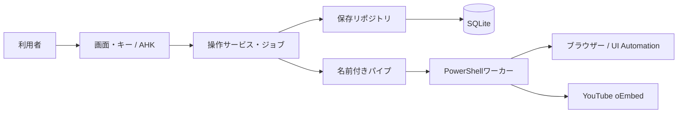
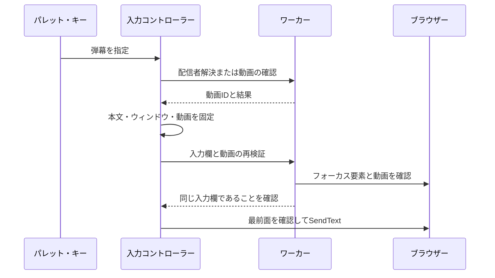
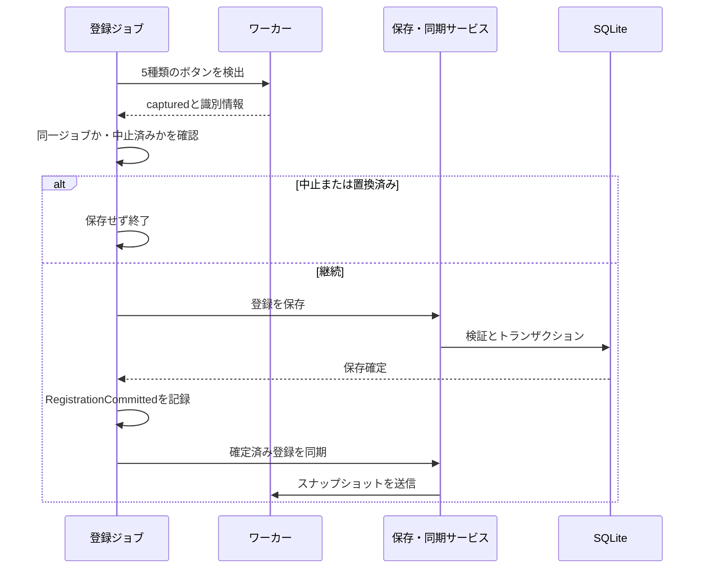

# 設計と状態の所有

[文書一覧](../index.md) · [開発手順](guide.md) · [検証](testing.md)

## システムの分担

AutoHotkeyプロセスが画面、キー、実行ジョブ、設定DBを所有します。PowerShellワーカーはUI Automationでブラウザーを調べ、リアクションを操作します。ワーカーは必要になった時点で起動し、その後は再利用します。

oEmbedへの問い合わせは動画の配信者情報を解決するときに使い、文字入力の直前検証やリアクションの各操作に毎回問い合わせる構成ではありません。

| 層 | 所有するもの | 担当しないもの |
|---|---|---|
| [src/ui/](../../src/ui) | 表示・編集対象・画面操作の案内 | SQL、パイプの送受信 |
| [src/library/](../../src/library) | 弾幕・配信者コマンド、取り消し履歴 | ウィンドウやUIA要素 |
| [src/settings/](../../src/settings) | 検証、保存計画、スキーマ、移行、設定確定 | ブラウザー操作 |
| [src/storage/](../../src/storage) | SQLite接続・ステートメント・トランザクション・バックアップ | アプリの項目名やGUI |
| [src/input/](../../src/input) | 入力内容と対象動画の確定、文字入力 | リアクション登録 |
| [src/reactions/](../../src/reactions) | 実行ジョブ・回数・間隔・キャンセルの判断 | UIAの探索方法、DBのSQL |
| [src/browser/](../../src/browser)のAHK | リクエスト、ワーカー寿命、登録の保存・同期の橋渡し | 編集対象の決定 |
| [src/browser/](../../src/browser)のPowerShell | 動画・入力欄・ボタンの検出、操作、メモリキャッシュ | 設定DBへの保存 |

## 状態を混ぜない

| 状態 | 意味と更新の責任 |
|---|---|
| `InputProfileId` | 入力に使用する配信者ID。空文字は未選択。選択サービスで保存する |
| `EditingProfileId` | 管理画面の編集対象ID。空文字は共通弾幕。入力対象とは独立 |
| `TargetBrowserHwnd` | 操作対象のブラウザーウィンドウ。動画の同一性は別に検証する |
| `ActiveReactionJob` | 開始時に固定した種類・回数・間隔・動画・キャンセル状態 |
| `IsBrowserOperationBusy` | UIや次の操作がブラウザー処理へ重ならないための状態 |
| `WorkerState.RequestActive` | 通信層で要求を多重化しないための状態 |
| `LastBrowserOperation` | 診断用の直近操作。表示用照会では上書きしない場合がある |

画面上の配列位置は永続識別子ではありません。配信者・弾幕のGUIDは移動・編集・並べ替えでも保持し、追加・複製では新規発行します。GUIは配信者IDとコマンドをサービスへ渡します。配列位置への変換は画面の選択肢を表示するときに行い、DBの`active_scope`も同じIDを保持します。旧INIの位置指定は取り込み時だけIDへ変換します。一覧の選択復元には非表示のID列を使い、名称・本文の一致には依存しません。

ライブラリの確定とUndoは`SaveLibraryDraft`で保存した後、`PublishLibraryState`から配信者・共通弾幕・入力対象・チャンネル索引を反映します。再読み込みも同じ公開処理を使います。公開済みデータを画面から直接変更しないでください。

パイプ、通知ハンドル、プロセスID、要求番号は`worker_client.ahk`の`WorkerState`がまとめて所有します。登録サービスは`IsWorkerRegistrationCurrent`／`MarkWorkerRegistrationCurrent`／`InvalidateWorkerRegistration`を通じて同期状態を扱います。

`main.ahk`はデスクトップ用の入口です。モジュール一覧は`app_modules.ahk`、共通初期化は`InitializeApplication`に集約しています。隔離テストも同じ初期化を呼び、入口のコード断片を置換しません。外部処理の差し替え窓口は`RuntimePorts`です。通常は既定のWindows処理を使い、テストだけが隔離コピーの起動前にコールバックを設定します。

## 操作可否の判断

`EvaluateOperation(action,state)`は、一覧更新・ブラウザー処理・リアクション実行・編集ダイアログの状態を受け取る純粋な判定です。入力・編集開始・リアクション開始・共通設定の保存を区別し、停止は常に許可します。編集ダイアログ自身からの設定保存は許可しますが、通信やリアクションの処理中は拒否します。

ハンドラーは`OperationAllowed`、ショートカットの案内は`OperationPolicy`、画面の有効状態は`RefreshOperationControls`から同じ判定を使います。UIで無効化しても、既に届いていたイベントに備えて実行時に再確認します。動画や入力欄の直前検証は入力・通信層で引き続き行います。

## 弾幕入力の流れ

パレットの要求は`{ProfileId,ItemId,ExpectedText,Window,Origin}`で表し、複数の真偽値や行番号に意味を持たせません。キー入力は`ResolveShortcutInput(scope,slot,hwnd)`で配信者と割当を一度解決してからIDへ変換します。`PlanDanmakuInput`は、同じIDと表示時の本文を確認して本文・動画・ウィンドウを固定します。解決中の並べ替えで別の弾幕を選ばず、本文の変更や同文の別IDへの置き換えは拒否します。

自動選択はoEmbedのチャンネルキーと登録済み連携の照合です。配信者名の類似検索はしません。動画IDはブラウザーのURL欄から読み、取得後にも確認します。入力欄は編集可能性、表示・有効状態、Document祖先、チャット／コメントの構造や名称から判定します。最終URL確認後に、フォーカスされた要素が同一であることも調べます。

検証と`SendText`は別処理であり、完全に不可分ではありません。判定不能は拒否し、入力先を推測して続行しません。文字送信のEnter操作は行いません。

## ページ操作のショートカット

`ShortcutDefinitions`が全10操作の初期キー・名称・適用範囲を定義します。`main.ahk`は固定HotIf定義を持たず、`InstallApplicationShortcuts`が保存済みの割当を登録します。パレットはグローバル、停止はリアクションジョブ存在時、他の操作はブラウザー最前面時だけ有効です。キー変更時は正規化した全割当の重複を検証し、変更された旧キーを解除してから新キーを登録するため、キー同士の交換も可能です。保存失敗・登録失敗時は新キーを解除して旧キーを復元します。GUIとヘルプは現在の割当から表示します。

`page_actions.ps1`の`chat_focus`は、表示中・編集可能なチャット欄を一意に探索します。既存の入力分類と祖先情報を共有し、動画と最前面を再確認してUIAの`SetFocus`を呼び、同じ要素にフォーカスできたことを確認します。クリアはその動画を固定して`verify_chat`で再検証した後、AHK側で全選択・Backspaceを送ります。コメント欄は受け付けず、クリップボードやEnterは使いません。検証とキー送信の間は不可分ではなく、実際の入力と同じ制約があります。

`reactions_show`はチャット内の表示用UIをID・限定した名称・専用のモデルクラスと祖先情報で識別し、その要素に属する操作可能な点へマウスを移動します。Chromiumがハート名で公開する表示用ボタンは、`yt-reaction-control-panel-button-view-model`と`collapsed-button`の組み合わせで個別の送信ボタンと区別します。入力欄の探索は編集用パターンを持つフォーカス可能要素に絞り、リアクションの祖先検査も候補の識別情報を確認した後に行います。個別の絵文字ボタンを名前から推測してクリックすることはありません。ポイント取得後にも動画・前面・要素を確認します。戻り値`hovered`はマウス移動の完了を表し、YouTube側でメニューが開いたことを保証する値ではありません。登録・メタデータの取得・リアクション送信は行いません。

## 登録の検出・確定・同期

`RequestBrowserOperation`は検出応答を返し、登録を自動保存しません。`FinalizeReactionCapture`がジョブの有効性を確認し、`SaveCapturedReactionRegistration`、`SynchronizeCapturedReactionRegistration`の順に呼びます。

中止確認から保存確定まではAHKの`Critical`で割り込みを抑止します。IPC中は通常の割り込み可能状態へ戻します。保存後に中止された場合は未保存と表示せず、確定済み登録の同期結果を知らせます。

保存失敗では以前の登録を維持します。同期失敗ではDBの新しい登録を維持し、古いワーカーを停止します。次の要求で再同期し、古い登録のまま操作を続けません。登録更新は通常、同じワーカーへ同期するため動画キャッシュを保持できます。

## リアクション実行と時間

ジョブは`CreateReactionJob`で同じ項目を持つ形に生成します。状態は`queued`（キー解放待ち）、`waiting`（カウントダウン・登録待ち）、`running`、`stopping`、`finished`です。進行状態の変更は`SetReactionJobPhase`、中止要求は`CancelReaction`、タイマー停止と現在ジョブの解除は`FinishReactionJob`に集約しています。古いジョブを終了しても、新しいジョブのタイマーや参照は解除しません。表示用状態はジョブから作り、表示文言・表示用Phaseで実行の終了を判断しません。

`RegistrationCommitted`と`RegistrationSynced`は別々に保持します。保存後の同期失敗でも保存を取り消さず、中止後に同期が完了した場合も確定済みの結果を維持します。

1要求ずつ送受信し、成功を確認してから次へ進みます。ジョブ開始後に管理画面の値を変えても、実行中の条件を更新しません。ランダムの値6はAHK側で各回1〜5へ解決し、ワーカーへ具体的な種類を渡します。

開始時刻は`QueryPerformanceCounter`で記録します。次の目標は直前の開始時刻＋指定間隔です。残り時間はメッセージ対応の`MsgWaitForMultipleObjectsEx`で最大10msずつ待ち、AHKのイベントを処理します。正の間隔でのみ`timeBeginPeriod(1)`を要求し、完了・中止・例外・通常終了時に対応する`timeEndPeriod(1)`を呼びます。精度の要求に失敗した場合は通常精度で継続します。

待機なしでもイベントを処理し、中止が届く機会を保ちます。遅延に追いつくための並列操作はしません。画面の進捗描画は最大100msごとにまとめ、回数計上と終了通知は省略しません。

ワーカーは動画・メニュー・ボタンを確認し、パターン取得後、`Invoke()`直前にも最前面を再確認します。Invoke開始前に結果を`unknown`へ変え、例外や通信断が起きても自動再送しません。操作済み数はUIA操作の完了数で、YouTube側の受理数ではありません。

## 永続化の契約

DBの`application_id`は1129335892、`user_version`は3です。形式1・2は段階的な移行対象で、他の未対応形式は拒否します。アプリの0.4系という版番号とは別です。

| テーブル | 内容 |
|---|---|
| `scopes` | 配信者と共通領域。共通のIDは`@shared` |
| `items` | 弾幕のGUID、所属先、順序、名前、本文、キー割当 |
| `preferences` | 入力対象、自動判別、リアクション標準設定・キー |
| `shortcut_bindings` | リアクション実行以外の9操作のキー。実行キーは既存のpreferences内を正本として維持 |
| `reaction_registrations` | ブラウザー別の識別情報。JSONをTEXT列内に保持 |

Windows標準SQLiteをシステムパスから読み込みます。接続ごとにDELETE、EXTRA、外部キーを有効化して結果を確認し、競合待機を100msに設定します。単一のAHKプロセスが設定を所有し、ワーカーへDB接続を渡しません。現在の構成ではWALや別のDBサービスを必要としません。

登録は5種類のトークン、型、重複、ブラウザー名、サイズを検証します。各登録はUTF-8で8192バイト未満、合計24000バイト以下です。JSONは可変長のUI識別情報をまとめて扱うためのDB内表現で、別ファイルへ二重保存しません。

書き込みはトランザクションで行い、成功してからメモリの状態と履歴を公開します。外部接続の更新はロック取得後に`data_version`で確認し、古い状態からの上書きを拒否します。読み込みもトランザクション内で行います。ホットキー登録はDB外の資源なので、設定サービスが登録・保存失敗時の取り消しを担います。

共通設定は`CreatePreferences`でライブラリ配列を含まない値として作り、`SaveSettingsPreferences`へ渡します。画面用の`Reaction/Count/Interval/Key`から保存名への変換は`PreferencesWithReactionOptions`に集約しています。ライブラリは`SaveLibrarySettings`、移行や全体保存は`SaveSettings`を使い、リポジトリも`SavePreferences`／`SaveLibrary`／`SaveAll`を区別します。ライブラリ保存は既存の共通設定を保持し、入力対象IDだけを一緒に更新します。

## 差分保存と履歴

公開済みの配列・項目は不変として扱い、編集する配列と項目だけを複製します。履歴は最大30件を保持し、変更のない項目は共有します。共有中の項目を直接書き換えると過去の履歴まで変わるため、必ずコマンド経由で編集してください。

保存計画は未変更の所属先を再利用します。変更された所属先では、共通の先頭・末尾を除いた範囲を`BuildScopeStorageDelta`で計算します。編集・追加・削除・移動・Undoごとの高速化分岐は持たず、同じ行検証・順序計算を使います。順序値の間隔が足りないときだけ所属先全体へ範囲を広げます。保存計画の行も不変として扱い、位置変更時は複製するため、失敗時に以前の計画を汚しません。順序値には間隔を設け、削除で全行を詰め直さず、空きが尽きたときだけ再配置します。隣接交換ではトランザクション中の一時値で一意制約の衝突を避けます。共通設定はライブラリ本文を再保存せず、同値なら不要な更新を省きます。

この設計でも配列比較・Map複製・画面一覧生成などに件数比例の処理は残ります。差分保存を「すべての操作が定数時間」と解釈しないでください。

## 初期化・移行・バックアップ

DBがない場合、旧`data/settings.ini`を検証して別名DBを作成します。新規状態では空のライブラリを作ります。移行結果と整合性を確認し、接続を閉じて正式名へ移します。元INIは変更しません。

形式1から2へのテーブル作成と旧登録JSON取り込みは同じトランザクションです。失敗時は部分移行を残さず、元JSONも変更しません。形式2以降では旧JSONを再読込しません。形式2から3へはキー設定テーブルをトランザクションで追加します。旧リアクションキーに重なるページ操作は未割当として保存し、従来の優先関係を維持します。旧ルート配置は探索しません。

起動中のバックアップはSQLite Backup APIで別名ファイルへ作り、整合性検査後に指定名へ確定します。既存ファイルを上書きしません。起動時復旧は元DBと付随ファイルを退避してから初期化します。運用上の手順は[保守](../user/maintenance.md)を参照してください。

## 通信と障害

ローカルの名前付きパイプで、4バイトの長さとUTF-8本文を送ります。本文は改行区切りの`キー=値`で、上限32768バイトです。要求番号`Seq`とウィンドウ`Window`を応答と照合し、接続元PIDが起動したワーカーであることも確認します。

応答待ちは通知イベントとWindowsメッセージを扱います。通常の要求は8秒、`verify`／`verify_input`は2.5秒を期限とします。ワーカーは要求がない間、パイプの読み込みで待機します。要求・応答用ファイルは作りません。

通信断・タイムアウトでは対象処理を失敗または結果不明にし、次の操作でワーカーを再起動します。終了時はパイプを閉じ、終了しないワーカーは停止します。反応がなかったという理由だけで副作用のある要求を再送しません。

## キャッシュと画面更新

| 対象 | 寿命・更新規則 |
|---|---|
| 動画メタデータ | ワーカー内、最大128件、12時間。取得失敗は5秒間再試行を抑制 |
| 登録の検索計画 | 登録オブジェクトの`PreparedPlan`に遅延生成。登録置換で失効 |
| ボタンのUIA参照 | 使用時に属性と所属ウィンドウを再検証。無効なら再探索 |
| 画面の選択肢 | 名称・順序・件数に変更がある場合だけ再生成 |
| パレットの検索 | 対象が200件を超える場合、最後の入力から100ms後へ集約 |

動画キャッシュは高速化用であり正本ではないため、ディスクへ保存しません。登録は利用者の設定としてDBに残します。ボタンの参照と属性値は永続化しません。

`library_presentation.ahk`が渡されたデータから選択肢・表示行・案内文を計算します。選択中の配信者の位置と実体は一度の探索で求めます。GUI・グローバル状態・通信に依存せず、画面側は完成したモデルをコントロールへ反映します。行モデルは項目への可変参照を保持しません。

パレットと管理画面の一覧更新は、それぞれ独立した`RefreshCycle`で再入要求を1回の再更新へ集約します。終了は`finally`で行い、例外後も更新状態を解除します。`PanelViewport`の配置・スクロール制御は別の責務として維持しています。

画面は非表示状態でサイズ・配置を確定してから表示します。進捗画面の部品はローカルで構築し、完成後に一式を公開します。弾幕一覧は行データを先に構築し、表示反映が終わるまで入力・編集を拒否します。操作直前には行番号と弾幕IDの一致を確認します。配置・スクロールも同じ更新状態を取得し、再入した更新は最新の要求を保留して終了後に反映します。フォーカス追従ではWinEventコールバックを使わず、表示中のパネルだけAHKタイマーで50msごとに現在のフォーカスを確認します。同じ要素なら再配置せず、非表示になるとタイマーを停止します。部品のハンドルと座標は固定長Bufferへ格納し、一覧は収集完了後に一括公開します。終了時は追従タイマーを解除します。主要パネルは表示領域への調整とスクロールを持ちますが、すべての補助ダイアログが同じリサイズ機能を持つわけではありません。一覧再描画では、タブによる一時非表示とAHKの明示的なHidden状態を混同しないでください。

パレットの有効状態とプレビュー、取り消しボタンの文言は、実際のコントロール値と比較して変更時だけ書き込みます。別の状態キャッシュは持ちません。ただし、非表示タブ内ではAHKが保持する意図した有効状態とネイティブの状態が異なるため、管理画面の有効状態は明示的な代入を維持します。

保存順序の割り当てでは、既存IDの並びから次の順序値を参照します。全件分の「次の順序値」配列は保持せず、間隔が不足した場合のみ既存の再配置処理へ進みます。先頭・途中・末尾への連続追加でも、公開済みの保存行を変更しません。

## 変更時に守る条件

- GUIは保存成功前の値を確定済みとして公開しない。
- 編集対象の変更を入力対象の変更へ流用しない。
- 非同期処理の応答を使う前に、ジョブの中止・置換を確認する。
- 保存成功とワーカー同期成功を区別する。
- 要素の検索成功だけで操作せず、操作境界で対象を確認する。
- 例外でもDB・パイプ・タイマー精度の資源を解放する。
- 画面文言を処理状態の判定条件にしない。

これらの条件に対応する検証は[検証ガイド](testing.md)にまとめています。
