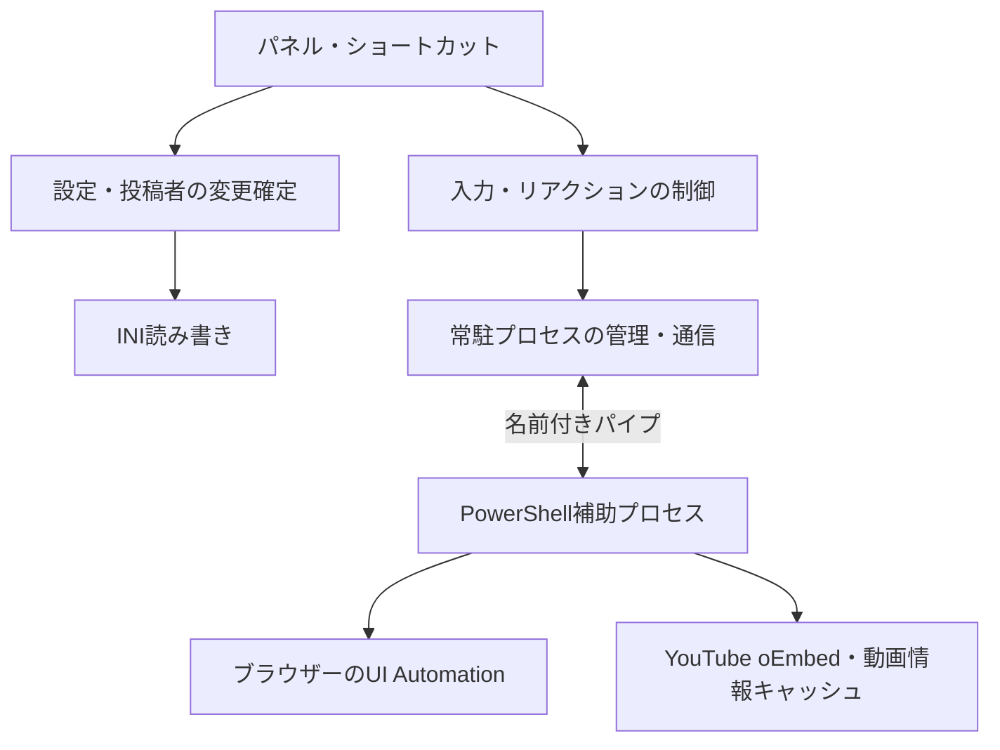

# 設計と責務の分担

[READMEへ戻る](../../README.md) · [開発・配布ガイド](guide.md)

プロジェクト: `youtube_chat_helper`。起動ファイル: `main.ahk`。パネル呼び出し: Ctrl＋Alt＋Q。

## 処理の全体像

弾幕の文字列入力はAutoHotkeyの `SendText` が担当する。PowerShell側は動画確認や投稿者の解決を担当し、Enterによるチャット送信はしない。リアクションはPowerShell側でUI Automationの操作を呼び出す。

## モジュールの役割

- `main.ahk`: 起動、操作の順序、投稿者選択、保存・取り消しの方針。`RequestBrowserOperation` は通信中の操作制限と表示を調整する。
- `app_ui.ahk`: 画面構築、表示更新、GUIイベントの受け取り。UIイベントは対象を確定してモデル／操作処理に渡す。
- `settings_store.ahk`: 設定全体の読み取り・候補データのINI書き込み。実行中のデータは更新しない。
- `settings_schema.ahk`: 設定の選択肢と既定値。読み込み・保存前検証・画面の選択肢が同じ定義を参照する。
- `settings_service.ahk`: 設定の読み込み・移行・変更確定。候補の保存に成功してから実行中の値へ反映する。キー変更はコールバックを抑止した区間で準備し、保存失敗時に旧登録へ戻す。
- `profile_service.ahk`: 投稿者の追加・名前変更・関連付け・削除・取り消し・選択の保存。UIを作らずに呼び出せる。
- `worker_client.ahk`: 常駐プロセスの管理、名前付きパイプ、要求と応答、タイムアウト。GUIを参照しない。
- `danmaku_library.ahk`: 明示した弾幕リストの操作と復元。画面の選択状態、保存、入力操作を参照しない。
- `chat_input.ahk`: 投稿者別／共通の文字列の解決と入力。`DeliverText` は確定した文字列・対象ウィンドウ・動画IDを受け取る。
- `reaction_drafts.ahk`: 編集開始・破棄に伴う下書きの作成。GUI部品を参照しない。表示更新では下書きを作り直さない。
- `reaction_controller.ahk`: リアクションの設定操作、キー登録、実行・停止・回数管理。
- `app_lifecycle.ahk`: 起動時のデータ移行・復旧の案内と、診断画面。実行バージョンは `VERSION` から取得する。
- `browser_worker.ps1`: URL欄から動画IDを取得し、要求を各機能へ振り分ける。
- `input_target.ps1`: フォーカスされた編集欄と祖先要素から、チャット欄・コメント欄を検証する。レコードの分類とUI Automation取得を分離する。
- `video_metadata.ps1`: oEmbed取得、キャッシュの読み書きと期限管理。
- `reaction_automation.ps1`: リアクションボタンの登録対象の検出・操作。
- `reaction_store.ps1`: ボタン登録の読み込み・形式検証・候補の保存と、保存成功後のメモリ反映。

## 状態と保存の流れ

アプリ設定は `data/settings.ini` に保存し、編集中のリアクション設定は別の下書きに保持する。画面変更時に下書きを更新し、保存時には下書きを検証して候補の設定全体を書き出す。書き込みに成功してから実行中の設定へ反映する。投稿者管理と弾幕操作は、操作の確定時に保存する。

INIの文字列値は外側に引用符を追加し、読み込み時に元の引用符・前後の空白を保持する。改行を含む文字列は保存前に拒否し、既存ファイルを保持する。

リアクションの登録情報は5件の異なる識別情報を必要とする。形式が不正な登録は読み込まず、操作時も同じ実体のボタンを複数種類として扱わない。検索には登録時の名前とコントロール種別を使い、通常のButton以外の操作可能な要素も登録時と同じ条件で検索する。

`settings_schema.ahk` の選択肢・既定値を、読み込み時の検証、保存前の検証、画面の選択肢生成で共有する。

投稿者0件は正常な状態であり、選択位置は0となる。`GetSelectedProfile()` は未選択なら0を返す。投稿者別の下書きは作らず、共通弾幕・共通リアクションは独立して利用する。

## 通信と障害処理

補助プロセスは必要時に起動する。要求・応答は長さ付きUTF-8フレームでローカルの名前付きパイプを通す。要求の連番・対象ウィンドウを照合し、接続相手のプロセスIDも確認する。通常の要求は最大8秒、動画の再確認は最大2.5秒で待機を打ち切る。

通信失敗時は接続と補助プロセスを整理する。次の要求で再起動できるが、失敗した要求を自動再実行しない。特にリアクションは、操作後に通信が切れた場合に実行済みか判断できないため、結果不明を再送しない。

通信のためにディスクへ要求・応答ファイルを書き出すことはない。INIは設定変更時、ボタン登録JSONは登録時、動画キャッシュは新たな情報を取得したときに保存する。

## 自動判別と関連付け

ブラウザーのURL欄から現在の動画IDを取得し、動画IDに対応する投稿者情報をキャッシュまたはoEmbedから解決する。取得後に動画IDを再確認し、途中で動画が変わっていれば結果を適用しない。

関連付けは投稿者URLから正規化したチャンネルのパスをキーにする。表示名の類似度や部分一致では判定しない。保存済みの投稿者を索引化し、同一キーが複数あれば曖昧な関連付けとして扱う。ハンドル等の変更に追従する不変IDへの変換は行っていない。

## 変更時の規則

1. 通常の変更は `CommitProfileReactionDraft`、`CommitSharedReactionDraft`、`SaveLibraryTargets`、`ExecuteProfileCommand` などで確定する。実行中の値を書き換えてから保存しない。`SaveAppSettingsSnapshot()` は既存の状態をそのまま書き出す補助API。
2. 投稿者操作は `ExecuteProfileCommand` が保存後の履歴破棄・索引更新も担当する。画面から投稿者データを直接変更しない。
3. 取り消しは `CreateLibraryUndoSnapshot` に渡したリストのみ復元する。投稿者選択・リアクション設定を巻き戻さない。
4. 入力対象の文字列を決めるために、編集画面の選択を変更しない。
5. 投稿者別の下書きは編集開始時の投稿者オブジェクトを保持する。保存対象が一致しなければ保存を拒否する。
6. 通信によって元から無効だった画面を有効にしない。低水準の `SendWorkerRequest` は表示に触れず、`RequestBrowserOperation` が表示層を調整する。
7. 下書きは変更イベントで更新する。保存時にGUIから読み直さず、保持している下書きを保存する。
8. `ReadSettingsFile(path)` は設定全体を新しい値として返す。`ReloadAppSettings()` は取得・検証に成功した結果だけを一括で適用する。呼び出し前の配列クリアは不要。
9. 設定確定の区間はタイマー・キー処理による割り込みを抑止する。成功・失敗のどちらでも以前の割り込み設定を復元する。
10. 投稿者の切り替え可否は `CanChangeProfile` で判断し、保存サービスでも検証する。共通設定の未保存変更は切り替えを妨げず、切り替え後も保持する。
11. リアクションの実行状態はコントローラーの `ReactionExecutionStatus` が保持する。開始待ちの終了判断には `Phase` を用い、画面の文章を読み戻して判断しない。`RenderReactionStatus` は表示と表示タイマーだけを担当する。
12. 初期設定は投稿者・投稿者別弾幕・共通弾幕がすべて0件。最後の投稿者を削除しても代替データを作らない。選択がない場合は `GetSelectedProfile()` が0を返し、投稿者別編集を無効にする。共通設定・共通弾幕は独立して利用できる。

AutoHotkeyの共有状態は残している。ファイル分割だけで隔離されたモジュールになるわけではないため、GUI依存の禁止と上記の契約をテストで確認する。

## 入力対象の検証

弾幕の入力直前に `verify_input` を要求する。自動判別OFFでも省略しない。動画ID・対象ウィンドウ・フォーカス・編集可能性・表示状態を検証し、Web文書内のYouTube固有要素または対応する日本語・英語の入力欄名で分類する。識別不能なら停止する。

Chromiumの入力欄は `Edit` ではなく `Custom` と `TextPattern` で公開される場合がある。`ValuePattern` がなければ `TextPattern.IsReadOnlyAttribute` が明確に `false` の場合を編集可能とする。属性が未対応・混在なら許可しない。祖先は `RawViewWalker` で最寄りのWeb文書まで、最大45要素を確認し、入力欄を識別するコンテナーの省略を防ぐ。テキスト本文は取得しない。

画面の検索欄やアドレス欄は対象外。動画IDを取得できないチャンネルホーム等も対象外。入力欄の内容は検証要求へ含めない。UI Automation確認後にAutoHotkeyが文字を入力するため、確認と入力は完全な単一操作ではない。直前の最前面確認を行うが、極短時間のフォーカス変化まで完全に排除できるものではない。

## 動画情報キャッシュ

最大128件、取得から12時間を保持期限とする。取得失敗は5秒間メモリ上で抑制する。キャッシュ保存に失敗してもメモリ上の情報は使用できる。通信要求そのものはファイルへ書き出さない。

キャッシュの置き換えに失敗した場合も一時ファイルを削除する。削除自体が権限やロックで失敗した場合は、キャッシュの利用を妨げずに処理を継続する。

## 個人データの配置

`data/` に設定・登録JSON・キャッシュ・設定復旧用バックアップを置く。旧配置からは、移行先が存在しないファイルだけを移動する。ファイル単位の移行なので、途中で失敗しても次回起動時に残りを移行できる。同名ファイルが両方にある場合は `data/` を優先し、旧ファイルを保持する。

起動時の設定読み込み失敗は、利用者に復旧方法を選択してもらう。`--smoke` ではダイアログを表示せず非0で終了する。自動初期化は行わない。
