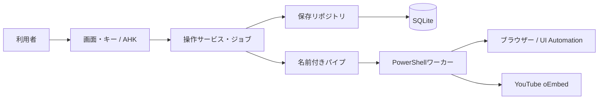
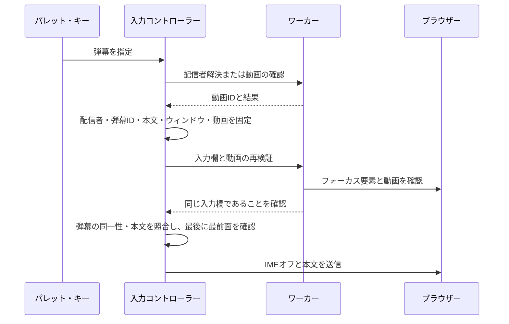
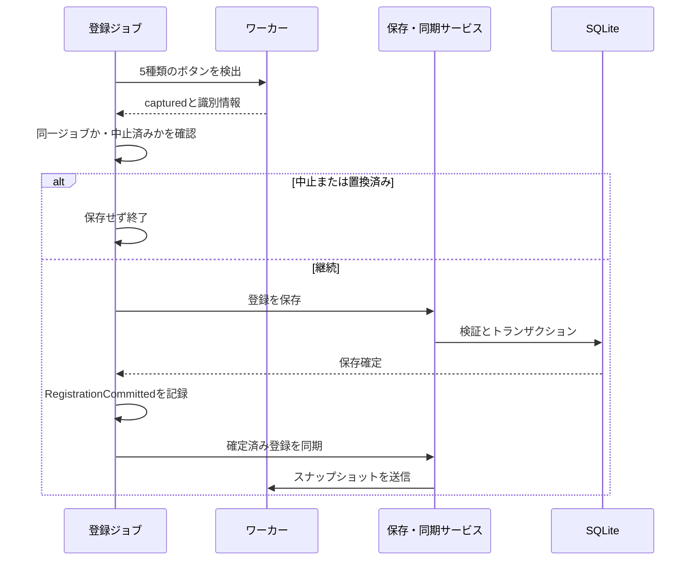

# 設計と状態の所有

[文書一覧](../index.md) · [開発手順](guide.md) · [検証](testing.md)

主な契約：[状態の所有](#状態を混ぜない) · [入力](#弾幕入力の流れ) · [登録の確定](#登録の検出確定同期) · [保存](#永続化の契約) · [画面更新](#キャッシュと画面更新)

## システムの分担

配信者・弾幕・動画・チャンネルの識別子は、表示名と区別して扱います。配信者IDは保存層と画面・操作層で大文字・小文字を区別し、検索や選択の際に正規化しません。

AutoHotkeyプロセスが画面、キー、実行ジョブ、設定DBを所有します。PowerShellワーカーはUI Automationでブラウザーを調べ、リアクションを操作します。ワーカーは必要になった時点で起動し、その後は再利用します。

oEmbedへの問い合わせは動画の配信者情報を解決するときに使い、文字入力の直前検証やリアクションの各操作に毎回問い合わせる構成ではありません。

| 層 | 所有するもの | 担当しないもの |
|---|---|---|
| [src/ui/](../../src/ui) | 表示・編集対象・画面操作の案内 | SQL、パイプの送受信 |
| [src/library/](../../src/library) | 弾幕・配信者コマンド、取り消し履歴 | ウィンドウやUIA要素 |
| [src/settings/](../../src/settings) | 検証、保存計画、スキーマ、設定確定 | ブラウザー操作 |
| [src/storage/](../../src/storage) | SQLite接続・ステートメント・トランザクション・バックアップ | アプリの項目名やGUI |
| [src/input/](../../src/input) | 入力内容と対象動画の確定、文字入力 | リアクション登録 |
| [src/reactions/](../../src/reactions) | 実行ジョブ・回数・間隔・キャンセルの判断 | UIAの探索方法、DBのSQL |
| [src/browser/](../../src/browser)のAHK | リクエスト、ワーカー寿命、登録の保存・同期の橋渡し | 編集対象の決定 |
| [src/browser/](../../src/browser)のPowerShell | 動画・入力欄・ボタンの検出、操作、メモリキャッシュ | 設定DBへの保存 |

`main.ahk`はデスクトップ用の入口です。モジュール一覧は`app_modules.ahk`、共通初期化は`InitializeApplication`に集約しています。起動引数は`main.ahk`だけで判定し、未知の引数や複数指定を初期化前に拒否します。設定復旧処理はコマンド引数を参照せず、`InitializeApplication(showRecoveryDialogs)`から復旧画面の表示可否を受け取ります。隔離テストは`InitializeApplication(false)`で同じ初期化を呼び、入口のコード断片を置換しません。外部処理の差し替え窓口は`RuntimePorts`です。通常は既定のWindows処理を使い、テストだけが隔離コピーの起動前にコールバックを設定します。

## 状態を混ぜない

| 状態 | 意味と更新の責任 |
|---|---|
| `InputProfileId` | 入力に使用する配信者ID。空文字は未選択。選択サービスで保存する |
| `EditingProfileId` | 管理画面の編集対象ID。空文字は共通弾幕。入力対象とは独立 |
| `TargetBrowserHwnd` | 操作対象のブラウザーウィンドウ。動画の同一性は別に検証する |
| `ActivePageAction` | フォーカス・クリア・リアクションUI表示の実行中操作。結果通知まで保持し、フォーカス時だけ最大1件の保留入力を受け付ける |
| `ActiveReactionJob` | 開始時に固定した種類・回数・間隔・動画・適用設定の表示・キャンセル状態 |
| `IsBrowserOperationBusy` | UIや次の操作がブラウザー処理へ重ならないための状態 |
| `WorkerState.RequestActive` | 通信層で要求を多重化しないための状態 |
| `LastBrowserOperation` | `RecordBrowserOperation`で記録する直近操作。操作・状態・対象・段階・所要時間を保持し、表示用照会は上書きしない |

画面上の配列位置は永続識別子ではありません。配信者・弾幕のGUIDは移動・編集・並べ替えでも保持し、追加・複製では新規発行します。GUIは配信者IDとコマンドをサービスへ渡します。配信者の選択肢は表示時の`{Id,Name}`を保持し、操作時に現在の配列位置からIDを引き直しません。パレット・管理画面・ショートカット管理・弾幕の移動先・チャンネル連携先は、`SyncProfileChoices`と`GetSelectedProfileId`でこの対応を共有します。選択したIDが削除されていたら選び直しを案内し、別の配信者を選択・保存しません。DBの`active_scope`も同じIDを保持します。一覧の選択復元には非表示のID列を使い、名称・本文の一致には依存しません。

ライブラリの確定とUndoは`SaveLibraryDraft`で保存した後、`PublishLibraryState`から配信者・共通弾幕・入力対象を反映します。再読み込みも同じ公開処理を使います。公開済みデータを画面から直接変更しないでください。

## 操作可否の判断

`EvaluateOperation(action,state)`は、一覧更新・ブラウザー処理・リアクション実行・編集ダイアログの状態を受け取る純粋な判定です。入力・編集開始・リアクション開始・共通設定の保存を区別し、停止は常に許可します。編集ダイアログ自身からの設定保存は許可しますが、通信やリアクションの処理中は拒否します。

ハンドラーは`OperationAllowed`、ショートカットの案内は`OperationPolicy`、画面の有効状態は`RefreshOperationControls`から同じ判定を使います。UIで無効化しても、既に届いていたイベントに備えて実行時に再確認します。動画や入力欄の直前検証は入力・通信層で引き続き行います。

## 弾幕入力の流れ

パレットの要求は`{ProfileId,ItemId,ExpectedText,Window,Origin}`で表し、行番号や複数の真偽値から意図を推測しません。キー入力は`ResolveShortcutInput(scope,slot,hwnd)`で対象を解決します。以降の責務は次のとおりです。

| 処理 | 担当と保証 |
|---|---|
| 割当の解決 | `PlanShortcutInput`がキーの割当を一度だけ弾幕IDへ変換する。通常入力は対象解決後、保留入力はキー押下時のライブラリを渡す |
| 入力計画 | `PlanDanmakuInput`が配信者ID・弾幕ID・本文・ウィンドウ・動画を固定する。`ValidateDanmakuInput`が計画作成時と送信直前に所属先・ID・本文を照合する |
| ブラウザー確認 | 通常・パレット入力は`DeliverDanmakuInput`が最前面を確認してから`VerifyInputTarget`を呼び、不成立なら`input_cancelled`を返す。`VerifyInputTarget`は動画・入力欄だけを担当する。保留入力は後述の`verify_chat`を使う |
| 文字送信 | 全経路が`SendPlannedDanmaku`を通る。アプリ内の割り込みを止めた範囲で計画を最終確認し、その後に操作可否と対象ウィンドウの最前面を確認して`SendInputText`を呼ぶ。保留入力は開始時のページ操作を明示的に渡し、所有が続き、期限内の場合だけ自身の処理中状態を除外する。照合中に前面が変わった場合や、別の編集・操作が始まった場合も`input_cancelled`で中止する。終了時は成否にかかわらず元の割り込み設定へ戻す |

ブラウザー確認中の本文変更・削除・移動・同文の別IDへの置換は拒否します。並べ替え、名前やキー割当だけの変更なら選択した弾幕を維持し、配信者やキーを解決し直しません。

自動選択では、oEmbedのチャンネルキーを配信者の`Channel`と`FindProfileByChannel`で厳密に照合します。`SelectProfileFromBrowser`は保存に成功した配信者ID・対象ウィンドウ・動画IDを一つの入力コンテキストとして返します。入力側は画面更新後もこの戻り値を使い、表示用の`DetectedChannel`や後から変わった入力選択から対象を組み直しません。`Channel`が連携の正本で、別の索引や配信者名の類似検索は使いません。 動画確認の例外は未取得の応答へ揃え、古いチャンネル・投稿者・動画を残しません。表示・復帰時は失敗してもパレットを開き、共通弾幕と失敗理由を表示します。保存済みの手動選択は変更せず、次回の判別で復旧します。空のチャンネルは一致とせず、重複した連携は保存・読込時に拒否します。`GetPaletteInputProfile`は選択中の配信者の連携先を確認し、有効な配信者を返します。表示・編集対象の解決はこの結果を使い、IDと有効フラグを別々に渡して再検索しません。

動画IDはブラウザーのURL欄から読み、取得後にも確認します。入力欄は編集可能性・表示・有効状態、Document祖先、チャット／コメントの構造や名称から分類します。`Get-YouTubeInputRecords`は対象の記録を一度取得し、編集不可・非表示・無効なら祖先探索を打ち切ります。フォーカス前の探索と`Get-FocusedYouTubeInput`は同じ取得・分類を使い、観測したフォーカス状態を書き換えません。後者は確認できた入力欄の種類とUIA要素を一つの結果（`Kind`・`Element`）として返し、失敗時は`null`を返します。

`Find-ChatInput`は検出状態と対象を一つの結果（`State`・`Element`）で返します。候補が一つの場合だけ`ok`と対象を返し、未検出・複数候補では理由と`null`を返すため、呼び出し元が失敗理由を別途初期化・受け渡す必要はありません。入力前には実際のフォーカスを確認し、最終URL確認後にも同じ要素か調べます。

通常・パレット入力の入口`RunDanmakuInput`は、対象解決から入力欄確認までの例外を同じ案内経路へ返します。入力前の例外では文字を送らず、ブラウザー要求側の後始末が操作制限と親画面を復旧します。

`SendInputText`はIMEオフ専用キーとリテラル本文を一回の`SendInput`に渡します。本文のキー記法は操作として解釈せず、Enterは送りません。入力後もIMEはオフのままです。成功は`inserted`、送信中の例外は一部入力済みの可能性があるため`unknown`とし、通常入力・保留入力とも自動再送しません。

対象検証とキー送信は完全に不可分ではありません。判定不能なら入力先を推測せず拒否します。

## ページ操作のショートカット

ページ操作は`ActivePageAction`がキー解放待ちから結果通知まで所有します。他の入力・編集・リアクション・設定変更は操作ポリシーで拒否し、所有中の処理は`CanContinuePageAction`で継続可否を確認します。通知に失敗しても所有を解除し、置換後の操作や結果を古い処理から変更しません。

パレット表示・管理画面からの復帰・標準設定を読み込んで戻る操作も、`CurrentOperationState().BrowserBusy`を確認し、処理中の対象・前面・今回設定を変えません。

### キー割当の確定

`ShortcutDefinitions`が全10操作の初期キー・名称・適用範囲を定義し、実行時の値は`ShortcutKeys`が保持します。DB形式3の`preferences.reaction_key`と9件の`shortcut_bindings`は、リポジトリの読み書きでのみ分離・結合します。読込時は`ReadShortcutKeys`が全操作のMapを組み立てます。`shortcut_bindings`にリアクション実行キーが重複して保存されている場合は、元のDBを変更せず読込を拒否します。

`ApplyPreferences`がキー登録・自動判別・リアクション既定値の確定を扱い、設定変更時は保存成功後に実行時の値を公開します。起動・再読込は保存せず同じ適用処理を通り、初回のキー登録は`InstallApplicationShortcuts`が担います。起動と設定変更は`CommitShortcutBindings`で登録・巻き戻しを共有し、設定変更時だけDB保存を同じ処理の確定操作として渡します。初回は全キーの登録成功後に登録済み状態を公開し、途中失敗では登録できたキーを解除します。再度の初期登録は何もしません。呼び出し元は登録から状態公開までを同じ`Critical`区間に含めます。パレットはグローバル、停止はリアクションジョブ存在時、他の操作はブラウザー最前面時だけ有効です。

キー変更時は正規化した全割当の重複を検証し、変更された旧キーを解除してから新キーを登録するため、キー同士の交換も可能です。保存失敗・登録失敗時は新キーを解除して旧キーを復元します。復元の一部が失敗しても残りを試み、元の原因と復元できなかった割当をまとめて通知します。この場合は保存済み設定を変更せず、再起動によるキーの再登録を案内します。実行画面のキー表示は確定済みの割当から作ります。「使い方」は操作手順を説明し、現在の割当は共通のショートカット管理画面へ直接移動して確認します。ヘルプには変更後に古くなるキー一覧を保持しません。

キー解放待ちは割当文字列を`WaitShortcutRelease`へ渡します。この入口が主キーを取り出し、Ctrl・Alt・Shiftと合わせて待機対象を決めます。弾幕・ページ操作・リアクションの呼び出し側は修飾キーを解析しません。保留入力は押下時の割当文字列を保持して同じ入口へ渡します。

### チャット欄と保留入力

`page_actions.ps1`の`chat_focus`は、編集用パターンを持つフォーカス可能要素から、表示中・編集可能なチャット欄を一意に探索します。動画と最前面を再確認してUIAの`SetFocus`を一度呼び、同じ要素へのフォーカス反映を最大350ms観測します。操作自体は再送しません。

フォーカス成功時にワーカーが返す一度限りのトークンは、動画と元のUIA要素を識別します。クリアと保留入力は、どちらも`verify_chat`でこの対象を再確認します。`verify_chat`はトークンを必須とし、省略・空値・不一致をブラウザー検査前に拒否します。成功・失敗を問わずこの要求がトークンを消費し、動画情報の取得や通常入力の確認は消費しません。

| 操作 | フォーカス後の処理 |
|---|---|
| クリア | `verify_chat`成功後、AHKから全選択・Backspaceを送る。コメント欄は受け付けず、クリップボードやEnterは使わない |
| 保留入力 | キー押下時のライブラリから入力計画を作る。待機後と送信直前の本文照合後は、同じ`CanContinueFocusedDanmaku`で所有・操作可否・前面・期限を確認する。成功・失敗を問わず終了時に保留状態を解放する |

保留はフォーカス操作だけが`AcceptsPending`で受け付けます。キー解放待ちの前から最大1件を受け付け、期限は保留したキーの押下から5秒です。フォーカス応答後は保留の有無を判断する前に受付を閉じ、入力後や通知中の要求を残しません。クリアも弾幕入力と同じく、対象検証とキー送信は完全に不可分ではありません。

### リアクションUIの表示

`reactions_show`はチャット内の表示用UIをID・限定した名称・専用のモデルクラスと祖先情報で識別し、その要素に属する操作可能な点へマウスを移動します。Chromiumがハート名で公開する表示用ボタンは、`yt-reaction-control-panel-button-view-model`と`collapsed-button`の組み合わせで個別の送信ボタンと区別します。

リアクションの祖先検査は候補の識別情報を確認した後に行います。名前・有効状態・表示状態は候補自身からだけ取得し、祖先はID・クラス・種類とウィンドウ境界を確認します。検証済みの要素と属性を一組で`Select-ReactionLauncher`へ渡し、選択中はUIA属性を再取得しません。折り畳まれた表示ボタン、正確なパネルID、その他の単独候補の順に優先し、優先候補が複数なら選択しません。

個別の絵文字ボタンを名前から推測してクリックすることはありません。ポイント取得後にも動画・前面・要素を確認します。戻り値`hovered`はマウス移動の完了を表し、YouTube側でメニューが開いたことを保証する値ではありません。登録・メタデータの取得・リアクション送信は行いません。

## 登録の検出・確定・同期

`Get-ReactionCapture`は、登録する5種類の識別情報`Tokens`と、その観測の診断文`Detail`を一つの結果として返します。検索側の`Select-ReactionRecords`も、操作対象`Elements`と`Detail`を一緒に返します。不成立時は識別情報・操作対象を空にし、理由だけを残します。診断用のグローバル変数や不完全なボタン群は後続処理へ渡しません。件数・型・重複は、登録の読み込みや検索計画の生成と同じ`Test-ReactionTokens`で検証します。登録と検索は`Get-ReactionRecord`で候補ごとの属性を一括取得します。登録時の種類判定・識別情報・診断名には同じ取得結果を使い、次の登録では再取得します。位置情報は診断候補の絞り込みだけに使い、候補ごとに一度取得した値で比較します。取得できない場合も識別済みの登録結果は維持し、収集済みの候補名を診断へ残します。登録用のUIA要素は関数内だけで扱い、使わない親コンテナーの識別情報は取得しません。

`RequestBrowserOperation`は検出応答だけを返します。`FinalizeReactionCapture`が現在のジョブと中止状態を確認し、`SaveCapturedReactionRegistration`で保存、`SynchronizeCapturedReactionRegistration`で同期します。診断は実行元の`ReactionCountdown`が検出から同期までの結果・所要時間をまとめて記録します。既存記録の部分更新はせず、ジョブが交代した場合も更新しません。

| 発生したこと | 保存と継続の扱い |
|---|---|
| 保存前の中止・ジョブ交代 | 保存せず終了する。中止確認から保存確定までは`Critical`で割り込みを抑止する |
| 保存失敗 | 以前の登録を維持する |
| 保存後の中止 | 保存を取り消さず、確定済み登録の同期結果を知らせる。IPC中は呼び出し元の割り込み設定へ戻す |
| 同期失敗 | DBの新しい登録を維持し、再同期成功までリアクション操作を止める |

登録状態の表示は、`ReadBrowserProcessName`で対象のブラウザー名を取得し、`HasReactionRegistration`でDBの登録有無を直接確認します。ワーカーの起動・同期・問い合わせ、画面の操作制限、診断の更新は行いません。「設定済み」は保存情報の有無だけを表し、現在のメニューを認識できるかは「② 送らずに確認」で調べます。読込失敗は「未確認」と理由を表示し、以前の表示を残しません。

保存確定はジョブの`RegistrationCommitted`、同期結果は戻り値の`State`が表します。ボタンの登録・検出確認・送信は`EnsureReactionRegistrations`を通り、通信層の`IsWorkerRegistrationCurrent`で同期済みのワーカーが生存しているか確認します。同期サービスは正常終了時に同期済みを保証し、失敗は理由付き例外へ揃えます。呼び出し元が`sync_failed`へ変換し、ワーカーが返した理由もリアクション結果の詳細へ引き継ぎます。同期済みフラグはワーカーの寿命に属し、停止時に解除します。別のPIDは保持せず、未同期の再起動直後も同期済みと扱いません。

同期拒否・同期処理の例外だけでは正常なワーカーを停止せず、動画キャッシュも保持します。通信断に伴う停止・資源保持・再起動は通信層だけが担当します。復旧後も失敗した要求を再送せず、新しい要求を処理します。

## リアクション実行と時間

`CreateReactionJob`が対象ウィンドウ・動画・適用設定・操作回数を持つジョブを生成します。段階は`queued`（キー解放待ち）、`waiting`（開始・登録待ち）、`running`、`stopping`、`finished`です。開始後の画面設定変更は実行条件へ反映しません。

予約開始時に対象ウィンドウを固定し、動画の問い合わせ・ジョブ作成・前面化で同じ対象を使います。問い合わせ後も操作可否を確認し、既に始まった別ジョブを上書きしません。

| 操作 | 所有と終了の責務 |
|---|---|
| `ScheduleReaction` | 登録・確認・送信の開始前に動画を確認する。例外も失敗応答へ揃え、操作可否を再確認してから通知する。別ジョブが始まっていれば開始も結果の上書きもしない |
| `StartReactionJob` | ショートカット・予約開始を共通処理し、ジョブ公開・前面化・進捗表示・タイマー登録を行う。前面化や表示の後にも所有を確認し、開始不成立なら元のジョブを終了する |
| `QuickReaction` | キー解放と開始条件を確認して送信へ引き継ぐ。開始失敗は待機ジョブを所有している場合だけ解放・通知し、失敗理由・例外詳細を保持する。中止済みなら中止を優先する |
| `ReactionCountdown` | 開始時のジョブを保持し、前面確認・ブラウザー応答・登録同期の後に所有を確認する。登録再待機は表示と次回タイマー登録が成功した場合だけ継続する |
| `ArmReactionTimer` | 開始と登録再待機に共通する入口。現在のジョブで中止・終了していないことを確認し、同じ`Critical`区間でタイマーを登録する |
| `SetReactionJobPhase` | 現在のジョブで、中止・終了していない場合だけ段階を変更する |
| `CancelReaction` | 現在のジョブに中止を要求する。通信中は操作結果を待つ |
| `FinishReactionJob` | 対象を終了にし、現在のジョブと一致する場合だけタイマー・参照・操作制限を解除して成功を返す |

開始・カウントダウン・送信ループの終了通知は、元のジョブを解放できた場合だけ公開します。中止・交代後の処理は、後続ジョブの残り時間・進捗・タイマー・操作制限や、確定済みの中止結果を上書きしません。実行用タイマーはカウントダウン・登録再待機・ショートカット開始に限定します。

`RunReactionSendLoop(job)`が送信中の回数計上と終了を所有します。開始時に所有を確認し、1要求ずつ送受信して成功後に次へ進みます。正常終了・失敗・中止・ジョブ交代は同じ`finally`で精度要求を解放して終了し、所有を解放できた場合だけ最終結果を公開します。交代後に正常応答が届いた場合も古いジョブを終了状態にします。ランダムの値6は各回1〜5へ解決してワーカーへ渡します。次の実行目標は直前の開始時刻＋指定間隔で、遅延に追いつくための並列操作はしません。

通信期限・保留入力期限・進捗描画・実行間隔・診断の経過時間は`AppClockMs`を使います。既定は`QueryPerformanceCounter`による単調増加のミリ秒で、テストでは`RuntimePorts.Clock`から置換します。小数を保持し、タイマーの待機時間は切り上げ、診断の経過時間は整数へ丸めます。

間隔待ちは`MsgWaitForMultipleObjectsEx`で最大10msずつ行い、AHKのイベントを処理します。待機なしでも中止が届く機会を保ちます。開始前の前面確認が失敗した場合は、送信要求もタイマー精度の要求も行いません。

正の間隔でのみ`timeBeginPeriod(1)`を要求し、成功した要求には完了・中止・例外・通常終了時の`timeEndPeriod(1)`を対応させます。精度の要求に失敗した場合は通常精度で継続します。平均間隔は開始時刻と完了数から計算し、別の文言状態として保持しません。

`ReactionNotice`は`State`と任意の`Detail`を持つ応答とジョブを受け取ります。応答の詳細取得と、送信失敗時の操作済み回数の文言を表示側へ集約し、開始前の動画確認から失敗理由を保持します。詳細のない応答では空の詳細を確定します。

表示状態はジョブから作り、実行終了の判定には使いません。表示上の終了は`Phase = finished`が表し、停止ボタン・即時描画・自動消去も同じ段階を参照します。診断は実行中のジョブの段階を読み、終了後だけ最後の表示状態を参照します。未知の段階は元のコードもレポートへ残します。

`FinishReactionJob`は所有解除と、その時点の表示状態の参照をジョブへ保持する処理を同じ`Critical`区間で行います。`SetReactionStatus`は所有確認と表示・最終結果の公開を同じ`Critical`区間で行い、解除後は保持した表示状態から変わっていない場合だけ結果を公開します。後続ジョブが実行中でも終了済みでも、古いジョブからの更新を拒否します。描画中に表示が更新された場合も失敗を返し、呼び出し元による古いツールチップの更新・消去を防ぎます。進捗描画は最大100msごとにまとめ、回数計上と終了通知は省略しません。

ワーカーは動画・メニュー・ボタンを確認し、パターン取得後、`Invoke()`直前にも最前面を再確認します。Invoke開始前に結果を`unknown`へ変え、例外や通信断が起きても自動再送しません。操作済み数はUIA操作の完了数で、YouTube側の受理数ではありません。

## 永続化の契約

DBの`application_id`は1129335892、`user_version`は3です。この形式のみを受け入れ、未対応形式は変更せずに拒否します。アプリの0.4系という版番号とは別です。

| テーブル | 内容 |
|---|---|
| `scopes` | 配信者と共通領域。共通のIDは`@shared` |
| `items` | 弾幕のGUID、所属先、順序、名前、本文、キー割当 |
| `preferences` | 入力対象、自動判別、リアクション標準設定・キー |
| `shortcut_bindings` | リアクション実行以外の9操作のキー。実行キーは既存のpreferences内を正本として維持 |
| `reaction_registrations` | ブラウザー別の識別情報。JSONをTEXT列内に保持 |

Windows標準SQLiteをシステムパスから読み込みます。接続ごとにDELETE、EXTRA、外部キーを有効化して結果を確認し、競合待機を100msに設定します。単一のAHKプロセスが設定を所有し、ワーカーへDB接続を渡しません。現在の構成ではWALや別のDBサービスを必要としません。

SQLの直接実行は[SQLiteの契約](https://www.sqlite.org/c3ref/exec.html)に従ってUTF-8へ明示変換し、OSの文字コード設定に依存させません。準備済みステートメントと引数はUTF-16 APIを使い、どちらの経路でもUnicodeを保ちます。

リポジトリ構築中にDB形式などの検証が失敗した場合は、公開前のSQLite接続を明示的に閉じてから元のエラーを返します。`LoadSettings`も読込に失敗した接続を閉じてからエラーを返します。修復後の再試行では新しい接続で読み込みます。

SQLステートメントは接続が所有し、同じSQLで再利用します。`Run`／`Rows`は終了時に、引数設定失敗はその場でリセットと引数解除を行います。次の呼び出しの開始時には重複してリセットせず、接続を閉じる際に全ステートメントを解放します。

登録は5種類のトークン、型、重複、ブラウザー名、サイズを検証します。登録JSONの同一オブジェクト内で、同じ項目名が複数ある場合も拒否します。ASCIIの大小文字違いとJSONエスケープ後の同名を含め、SQLiteとPowerShellで異なる値を採用する曖昧さを保存境界で排除します。

各登録はUTF-8で8192バイト未満、合計24000バイト以下です。JSONは可変長のUI識別情報をまとめて扱うためのDB内表現で、別ファイルへ二重保存しません。

弾幕の編集・複製・削除・上下移動・所属変更は、`ExecuteDanmakuCommand`へ配信者IDと弾幕IDを渡します。対象の位置はサービス内の`Critical`区間で厳密なID比較から求め、そのまま保存・公開まで進めます。編集・移動ダイアログは開いた時点の弾幕IDを保持し、一覧の並べ替え後も同じ対象を扱います。対象や所属が失われた場合は保存せず、選び直しを案内します。操作開始時に表示対象の配信者が失われていた場合も、追加・チャンネル連携を含めて選び直しを案内します。共通弾幕への表示の復帰と、操作対象の決定は区別し、削除済みIDを共通弾幕として扱いません。追加時は弾幕IDを空にしてサービスが生成し、戻り値の`Index`は保存後の画面選択に使います。

弾幕の追加・編集・移動・複製・削除・上下移動、取り消し、チャンネル連携の確定は、保存からダイアログ終了・一覧と選択の反映までを一つの`Critical`区間で扱います。管理一覧からの複製・削除・上下移動は、選択取得も同じ区間に含めます。保存済みデータと以前の画面選択が混在する間に次の編集が入ることを防ぎ、失敗・早期終了を含めて呼び出し元の割り込み設定へ戻します。チャンネル連携のブラウザー再確認はこの区間に含めず、通信中の操作受付を維持します。

書き込みはトランザクションで行い、成功してからメモリの状態と履歴を公開します。外部接続の更新はロック取得後に`SettingsRepository.VerifyDataVersion`で確認し、古い状態からの上書きを拒否します。通常保存とリアクション登録保存が同じ検証を使います。読み込みもトランザクション内で行います。ホットキー登録はDB外の資源なので、設定サービスが登録・保存失敗時の取り消しを担います。

保存層の比較基準は`SettingsRepository.Saved`へ集約します。弾幕の保存行・共通設定の値・外部更新番号を一組で持ち、独立した読込済みフラグは置きません。共通設定はアプリと同じ項目名と操作ID別のキーMapで比較し、配列の位置や操作の定義順には依存しません。呼び出し元から設定値とキーMapを複製するため、保存後や読込後の下書き編集は比較基準を変更しません。既存DBの未読込状態は0、新規スキーマは空の比較基準として表します。読込結果は検証とトランザクション終了までローカルに保持し、読込・保存が成功した後だけ比較基準を一度で差し替えます。途中の失敗では以前の基準を保持し、部分更新された基準で次の保存を計算しません。

共通設定は`CreatePreferences`でライブラリ配列を含まない値として作り、`SaveSettingsPreferences`へ渡します。画面用の`Reaction/Count/Interval`は`SaveReactionDefaults`で共通設定へ写します。この下書きはキーを保持せず、保存時の現在のキー割当を維持します。キー変更は`SaveShortcutMap`、自動判別の変更は`SaveAutoDetection`を入口とし、いずれも`ApplyPreferences`で検証・保存・公開します。

設定変更コマンドは、現在値の複製から保存・公開までを同じ`Critical`区間に含めます。保存は共通設定の全項目を扱うため、途中で別の設定や入力配信者の変更が割り込むと、古い値を書き戻す原因になります。

ライブラリは`SaveLibrarySettings`、共通設定は`SaveSettingsPreferences`を使います。リポジトリは`SaveLibrary`／`SavePreferences`で変更範囲を区別し、新規DBの初期化は`SaveAll`で保存します。テストの全件データ準備も同じ`SaveAll`を直接使います。ライブラリ保存は既存の共通設定を保持し、入力対象IDだけを一緒に更新します。

## 差分保存と履歴

編集コマンドの`CreateLibraryDraft`は配信者一覧の配列だけを複製し、未変更の配信者・弾幕配列・弾幕を共有します。配信者の情報や弾幕を変更する時点で、その所有者と変更する配列を複製します。テスト用の全件コピーと任意データの確定補助は`tests/fixtures/library-model.ahk`に置き、製品には読み込みません。

公開済みの配列・項目は不変として扱い、編集する配列と項目だけを複製します。弾幕編集・弾幕割当・配信者名・チャンネル連携は、入力検証後に保存される値を比較し、変更がなければDB保存・状態の再公開・履歴追加を省きます。名前は前後空白を除いた値、本文と識別子は厳密比較を使います。履歴は通常のライブラリと同じ`Profiles`・`SharedDanmakuItems`を持ち、操作名だけを加えます。最大30件を保持し、変更のない項目は共有します。共有中の項目を直接書き換えると過去の履歴まで変わるため、必ずコマンド経由で編集してください。

弾幕モデルはキー割当を`Slot`として必ず持ち、0を未割当、1・2を割当先とします。保存時に項目欠落を補完せず拒否し、表示・入力・コピーは同じ項目を直接読みます。追加・編集コマンドの入力で割当を省略した場合だけ、コマンド入口で0へ変換します。

弾幕のIDは追加・複製コマンドが生成し、編集・移動・保存・スナップショット作成では維持します。保存計画は呼び出し元の項目を変更せず、IDの欠損・空値を拒否します。保存に失敗したデータへ後からIDを補うことはありません。テストで保存用モデルを直接作る場合もIDを明示します。

保存計画は未変更の所属先を再利用します。変更された所属先では、共通の先頭・末尾を除いた範囲を`BuildScopeStorageDelta`で計算します。編集・追加・削除・移動・Undoは同じ行検証・順序計算を使います。変更・削除するIDの一覧は保存計画だけが持ち、保存後の比較基準には残しません。比較基準は読込時も保存後も、保存値と未変更判定に必要な情報だけを保持します。

順序値には間隔を設け、既存IDの並びから次の値を参照します。削除で全行を詰め直さず、間隔が足りない場合だけ所属先全体を再配置します。全件分の「次の順序値」配列は保持しません。隣接交換ではトランザクション中の一時値で一意制約の衝突を避けます。

保存行は`CreateStorageRow`で生成し、DB読込と差分計画で同じ形を使います。既存行の値を更新する場合は保存済みの順序から作り、順序が変わらなければ再複製しません。保存値はコピーして保持し、元の弾幕への参照は未変更判定に使います。保存計画の行も不変として扱い、位置変更時は複製します。先頭・途中・末尾への連続追加でも以前の計画を変更せず、保存失敗時も保全します。共通設定はライブラリ本文を再保存しません。共通設定の行と個別キーをそれぞれ保存済みの値と比較し、変わった保存単位だけSQLを実行します。差分がなくてもトランザクション内の外部更新確認は行います。

この設計でも配列比較・Map複製・画面一覧生成などに件数比例の処理は残ります。差分保存を「すべての操作が定数時間」と解釈しないでください。

## 初期化・バックアップ

DBがない場合、`CreateDefaultSettings`が空のライブラリと標準設定を作ります。形式3の全テーブルを一つのトランザクションで作成し、設定の保存結果と整合性を確認してから接続を閉じ、正式名へ移します。作成途中で中断しても未完成のDBを正式名では公開せず、次の起動で再試行できます。新規・既存とも、起動時のライブラリと共通設定は`ReloadAppSettings`で検証済みDBを読み込んでから公開します。

新規DBとバックアップの整合性検査は`SqliteConnection.CheckIntegrity`を共有し、DB構造と外部キーの参照先を確認します。起動中のバックアップはSQLite Backup APIで別名ファイルへ作り、この検査が通ってから指定名へ確定します。参照切れも含め、検査に失敗した場合は一時ファイルを除去し、元DBを変更しません。既存ファイルを上書きしません。

起動時復旧は、指定したDBとその付随ファイルを退避してから初期化します。移動は一つの処理で記録し、途中で失敗した場合は初期化せず、移動済みファイルを逆順で元へ戻します。一部を戻せなくても残りの復元を続け、戻せなかったファイルの退避先と元の場所をエラーに含めます。運用上の手順は[保守](../user/maintenance.md)を参照してください。

## 通信と障害

パイプ・通知・プロセスのハンドルと要求番号は`worker_client.ahk`の`WorkerState`がまとめて所有します。生存確認は通信と診断で同じ`IsWorkerRunning`を使い、PIDは保持したプロセスハンドルから取得して通信相手の照合に使います。登録サービスは`IsWorkerRegistrationCurrent`／`MarkWorkerRegistrationCurrent`／`InvalidateWorkerRegistration`を通じて同期状態を扱います。

起動は`CreateProcessW`が返したプロセスハンドルを保持し、不要なスレッドハンドルを直ちに閉じます。終了したプロセスのPIDは再利用され得るため、停止対象をPIDから開き直しません（[Windowsのプロセス識別とハンドルの仕様](https://learn.microsoft.com/en-us/windows/win32/api/processthreadsapi/ns-processthreadsapi-process_information)）。起動・終了は`Critical`区間で所有を更新します。`EnsureWorkerRunning`は残っているプロセスの終了を確認してから新規作成を始め、起動途中の失敗では新規作成した資源を解放します。起動前の終了処理は新規作成の巻き戻し対象に含めません。`NativeSendWorkerRequest`は起動例外を応答の`Detail`へ残して受付を解除し、同じ失敗で後始末を再度呼びません。終了時はパイプを閉じて250ms待ち、残っている場合だけ同じハンドルのプロセスを終了して最大2秒待ちます。終了を確認してハンドルを閉じ、確認できなければエラーにしてプロセスハンドルを保持し、次の後始末で再試行できるようにします。

`Start-BrowserWorker`が通信ループと資源解放を所有し、通常は`Invoke-WorkerRequest`を呼びます。ワーカーの寿命はパイプ接続で管理し、起動時の通信識別子はパイプ名だけを渡します。5秒以内に接続できない場合、通知イベントを開けない場合、接続が切れた場合は終了します。テストは専用の入口と要求ハンドラーを渡し、本番ワーカーのソースを置換しません。

ローカルの名前付きパイプで、4バイトの長さとUTF-8本文を送ります。本文は改行区切りの`キー=値`で、上限32768バイトです。要求番号`Seq`とウィンドウ`Window`を応答と照合し、接続元PIDが起動したワーカーであることも確認します。

応答待ちは通知イベントとWindowsメッセージを扱います。通常の要求は8秒、入力前確認の`verify_input`／`verify_chat`は2.5秒を期限とします。ワーカーは要求がない間、パイプの読み込みで待機します。要求・応答用ファイルは作りません。

通信断・タイムアウトでは対象処理を失敗または結果不明にし、次の操作でワーカーを再起動します。時間切れ、応答前のプロセス終了、送受信や応答照合の例外は、観測した原因を既存の応答`Detail`へ残します。リアクションの結果詳細にも同じ原因を渡し、結果不明を未実行とみなしたり、原因から自動再送を判断したりしません。

`NativeSendWorkerRequest`は失敗時の後始末を一か所にまとめ、通信本体の例外を捕捉する範囲の外で実行します。終了確認の失敗を通信失敗として捕まえて再度終了処理を呼ぶことはせず、呼び出し元へ返します。後始末中も要求の再入を拒否し、失敗しても要求受付と親画面の操作制限を解除します。反応がなかったという理由だけで副作用のある要求を再送しません。

## キャッシュと画面更新

### キャッシュの寿命

| 対象 | 寿命・更新規則 |
|---|---|
| 動画メタデータ | ワーカー内、最大128件、12時間。取得失敗は5秒間再試行を抑制 |
| 登録の検索計画 | 登録同期時に生成し、ブラウザー別の辞書に保持。登録置換で失効 |
| アドレスバーのUIA参照 | ワーカー内、最大16件。使用時にプロセスIDを照合し、値を読み直す。非表示・取得失敗なら再探索 |
| ボタンのUIA参照 | 使用時に属性と所属ウィンドウを再検証。無効なら再探索 |
| 画面の選択肢 | 名称・順序・件数に変更がある場合だけ再生成 |
| パレットの検索 | 対象が200件を超える場合、最後の入力から100ms後へ集約 |

アドレスバーの新規探索は、候補から最大30階層の親要素を調べ、文書を通らず対象ウィンドウへ到達した場合だけ採用します。階層上限・親要素の欠落・別ウィンドウなどで所属を確定できない候補は、値を読まずキャッシュにも入れません。

アドレスバーの有効性は`Read-AddressBarVideoId`で判定し、キャッシュ利用と新規探索から共通で呼びます。非表示・値の取得失敗は無効な参照として扱います。一方、URLを編集中、またはYouTube動画以外なら動画未確定を返し、その理由だけでは別の要素を探索しません。URL自体はキャッシュしません。

リアクションの検索計画は登録同期時に`New-ReactionPlan`が検証・生成し、すべて成功した場合だけブラウザー別の辞書を置き換えます。不正な登録では以前の計画とUI要素キャッシュを維持します。検出とキャッシュ再検証はこの計画を直接使い、登録の原文オブジェクトや別の計画生成状態は保持しません。候補照合の診断は最後にまとめて確定し、実行時IDが不明・重複している場合も今回の対象と理由を記録します。テストもこの製品経路と`Select-ReactionRecords`を使い、別の条件生成経路を持ちません。

動画キャッシュの初期化と期限管理は`video_metadata.ps1`が所有します。`Trim-Cache`で成功結果と失敗記録の期限をそれぞれ確認し、期限切れと現在より未来の記録を破棄します。時計が戻っても失敗の再試行抑止を引き延ばしません。取得処理は整理済みの記録の有無だけで判断します。高速化用であり正本ではないため、ディスクへ保存しません。登録は利用者の設定としてDBに残します。ボタンの参照と属性値は永続化しません。

### 一覧と描画

`library_presentation.ahk`は引数から選択肢・表示行・案内文を計算し、GUI・グローバル状態・通信に依存しません。キー表示には呼び出し元が現在の割当を必ず渡し、標準キーへの暗黙の補完は行いません。`BuildPresentationRow`で作る行は、項目への可変参照を持たず、名前・本文・キー表示・弾幕IDを保持します。所属は`ProfileId`で表し、空値は共通弾幕です。名前と本文の連結はパレットの描画時に行います。

保存後の反映は次の順序で行います。上下移動も、全件表示と同じ行モデル・更新の所有者・復元処理を使います。

| 入口 | 責務 |
|---|---|
| `RefreshManagementAfterCommand` | 更新対象と保存済みの通知を渡し、描画失敗を保存失敗と区別する |
| `RefreshLibraryViews` | パレットと管理画面をそれぞれ更新し、一方が失敗しても他方を試みてからエラーをまとめる。非表示パレットは再表示時に更新する |
| `RefreshManagement` | `RefreshCycle`で更新を所有し、全件表示・保存後の行選択・上下移動の描画処理を呼ぶ。`finally`で所有を解除し、ボタン状態を反映する |
| `BeginListRefresh`／`EndListRefresh` | 描画停止と、選択・スクロール位置・非表示状態の復元を担当する |

保存済みの操作は描画失敗で再実行しません。表示データを先に構築し、反映中は操作ポリシーで入力・編集を拒否します。上下移動は二行だけを更新し、移動したIDの新しい位置を復元処理へ渡し、通常の位置復元で全行検索を避けます。弾幕操作ボタンの状態反映は更新後にまとめ、移動ボタンのフォーカスを維持します。

管理画面の初回表示は構築時に更新した一覧を使い、表示直前の二重更新を行いません。再表示では一覧を更新してから要求されたタブを選び、非表示中の変更と選択した項目を反映します。

パレット・管理画面・リアクション進捗は独立した`RefreshCycle`を持ち、更新中の再入を一回の再更新へ集約します。予約した再更新より先に新しい更新が始まった場合は、その更新で予約を満たすため古いタイマーを取り消します。新しい更新中に再入した要求は、改めて一回だけ予約します。`PanelViewport`による配置・スクロール制御は別の責務です。

操作対象は表示名や本文ではなく、非表示のID列で照合します。

| 画面 | 選択の解決と不一致時の動作 |
|---|---|
| パレット | `GetSelectedPaletteRow`が表示上のIDを公開済み行モデルと照合する。列の並べ替えを許すため、表示位置を配列添字には使わない。対象がなければプレビュー・入力へ進まない。編集開始では現在の所属・ID・本文も確認し、不一致の行を編集対象として返さない。最大500行を調べ、別の索引や並べ替え状態は保持しない |
| 管理画面 | `GetSelectedManagedTarget`が`GetLibraryItems`で表示対象の所属IDを検証し、行位置と現在の弾幕IDを照合して、配信者ID・弾幕・位置を一組で返す。呼び出し元は対象を引き直さない。描画失敗などで古い行が残った場合は再描画して選択を解除し、選び直しを案内する |

配信者の選択肢は`SyncProfileChoices`が`{Id,Name}`のスナップショットとして保持します。名前が同じならネイティブの選択肢を作り直さず、IDだけの変更も反映します。再生成に失敗した途中状態からIDを解決しません。

非表示タブとAHKの明示的な`Hidden`状態を混同しないでください。管理画面の有効状態は、非表示タブでは意図した値とネイティブの値が異なるため、明示的に代入します。パレットの有効状態・プレビュー・取り消しボタンの文言はコントロールの現在値と比較して必要時だけ書き込み、別の状態キャッシュは持ちません。

### 編集画面の寿命

編集の所有状態は`ActiveEditorDialog`へ集約し、弾幕編集だけの別ウィンドウ状態や再表示経路は持ちません。編集開始と画面表示を同じ例外復旧範囲に含め、親画面を無効化する途中で失敗しても既存の終了処理を通します。弾幕編集・移動・チャンネル連携・ショートカット管理では部品の構築もこの範囲に含め、未公開のウィンドウも破棄します。

ショートカット管理は作成から表示までを一つの入口が所有し、作成済みのスクロール資源も失敗時に解放します。構築から表示までと終了処理は短い割り込み抑止範囲とし、途中状態を公開せず、終了時に元の割り込み設定へ戻します。

編集状態の終了は`EndEditorDialog`へ所有画面を渡し、現在の`ActiveEditorDialog.Window`と一致する場合だけ解除します。この入口が所有者の確認、編集状態の解除、親画面と操作ボタンの復帰を短い`Critical`区間で完了させ、成功・失敗とも呼び出し元の割り込み設定へ戻します。復帰途中に新しい編集を始めさせず、古い画面の終了通知も新しい編集状態や親画面の有効状態を変更しません。 専用ウィンドウの終了は`DestroyEditorDialog`がスクロール監視の解除、編集状態と親画面の復帰、ウィンドウ破棄を順に担当し、途中で失敗しても残りの後始末を実行します。配信者編集で既存の管理画面を使う場合は、`EndEditorDialog`で編集状態だけを終了します。

弾幕編集とショートカット管理は、下書きと保存済み状態を比較し、変更がある場合だけ閉じる前に破棄を確認します。 キー割当の差分は`ChangedShortcutBindings`で求め、登録・解除、管理画面の変更表示、保存・破棄確認で共用します。修飾キーの順序と英字の大小だけが違う場合は変更に数えません。

ショートカット管理のキー保存と弾幕割当保存は、それぞれ入力確認から保存済み基準・表示の更新まで同じ`Critical`区間で完了させます。保存直後に届いた次の編集を今回の保存基準へ取り込まず、完了後に未保存の変更として表示します。

確認取消では入力と親画面の無効状態を保持します。保存成功時は確認せず閉じます。確認ダイアログの呼び出しは`ConfirmEditorDiscard`を共有します。

チャンネル連携を開く前の取得では、例外を失敗応答へ揃え、理由を管理画面に表示します。取得後は既存の編集所有・操作可否の確認を通し、待機中に別の編集や処理が始まった場合は候補も失敗通知も反映しません。

チャンネル連携は保存ボタンを押した時点の配信者IDと入力名を確定してから、ブラウザーのチャンネルを再確認します。待機中に画面の値が変わっても、その保存操作の対象を読み直しません。チャンネルが変わった場合や選択したIDが削除された場合は保存を拒否します。確認の終了後は同じ`ActiveEditorDialog`が所有していることを確かめてから保存・通知します。確認中に画面を閉じた場合は成功応答でも保存せず、失敗応答も破棄し、後から開いた編集画面を変更しません。

弾幕編集・移動・チャンネル連携は保存成功後に編集画面を閉じてから一覧を更新します。一覧更新の失敗で保存済みの操作画面を残さず、保存失敗では下書きを保持します。ショートカット管理は画面を開いたまま保存するため、保存成功直後に下書きの基準を更新します。その後の描画失敗は保存失敗と区別して通知し、保存済みの変更を未保存へ戻しません。

ショートカット管理の配信者選択も`SyncProfileChoices`と`GetSelectedProfileId`を使います。弾幕候補の所属ID・表示位置・項目ID・保存済み選択は、一つの`itemState`として保持します。候補の更新開始時にこの状態と編集・保存を無効化し、2つの候補欄が完成してから公開します。途中で失敗した場合は割当を保存せず、対象を選び直すことで更新を再試行できます。保存先は公開済みの所属IDに固定し、現在の配信者選択とも照合します。

### 画面の構築と配置

画面は非表示状態でサイズ・配置を確定してから表示します。進捗画面はウィンドウと部品をローカルで構築し、完成後に一つの`ReactionOverlay`（`Window`・`Text`・`Hint`・`Stop`）として公開します。構築中の再入防止は`ShowReactionProgress`内で管理し、失敗時は未公開のウィンドウを破棄して再試行を可能にします。

「使い方」と「リアクションの実行結果」は`ShowInfoDialog`が所有ウィンドウの生成・書体設定・表示・終了時の破棄を担当し、各ビルダーは内容だけを組み立てます。構築・表示の失敗でもウィンドウを破棄し、原因を返します。実行結果は開いた時点の結果を渡し、画面表示とコピーが同じ内容を使います。

診断画面は部品構築・初期情報取得・viewport準備がすべて成功してから公開します。途中の失敗では未公開のウィンドウを破棄して原因を返し、次の表示要求で再作成できます。viewport構築中の監視解除は`PanelViewport`、ウィンドウの破棄は`CreateDiagnosticPanel`が担当します。

診断の更新は情報取得を先に済ませ、表示とコピー用スナップショットの公開だけを短い`Critical`区間で行います。情報取得の失敗なら直前の完成済み表示を保持し、表示途中の失敗ならコピーを無効にします。新しいスナップショットとコピー操作は、全項目の反映が成功してから有効にします。

配置・スクロールも更新状態を取得し、再入した更新は最新の要求を保留して終了後に反映します。各処理は開始時に自分の予約を消費し、直接実行した新しいスクロールで古い予約も置き換えます。保留処理では配置を終えてから最新のスクロール位置を読み、配置中に届いた要求を古い位置で上書きしません。部品のハンドルと座標は固定長Bufferへ格納し、一覧は収集完了後に一括公開します。主要パネルは表示領域への調整とスクロールを持ちますが、すべての補助ダイアログが同じリサイズ機能を持つわけではありません。

フォーカス追従ではWinEventコールバックを使わず、表示中のパネルだけAHKタイマーで50msごとに現在のフォーカスを確認します。新しいフォーカスを観測した時点で古いスクロール予約を破棄し、対象が既に見えていて移動不要の場合も予約を残しません。同じ要素なら再配置せず、非表示または終了時には追従タイマーを停止します。

`PanelViewport`はスクロール・サイズ変更・終了の監視とタイマーを所有し、画面自体の破棄は呼び出し元が担当します。構築前に解放に必要な参照を揃え、座標取得や監視登録の途中で失敗しても`Dispose`を通します。`Dispose`は監視を解除した後、束縛メソッドと画面・配置・座標の参照を切り、二度目以降は何もしません。監視を解除するだけでは、自分を参照する束縛メソッドが残ります。[AutoHotkeyの参照管理](https://github.com/AutoHotkey/AutoHotkeyDocs/blob/v2/docs/Objects.htm)に従い、この循環を明示的に解消します。

### 待機と通知

通信待ちと編集ダイアログは、`CaptureEnabledAppWindows`で開始時に有効だった親画面の参照だけを保持し、`SetAppWindowsEnabled`で無効化・復旧を共有します。元から無効だった画面は変更せず、終了時も開始時の画面だけを復旧するため、途中で置き換わった画面を有効化しません。一部で失敗しても残りの画面を試み、エラーをまとめて返します。操作ボタンの状態更新は復旧の成否にかかわらず行います。

ブラウザー操作の待機表示は、`CreateWorkerWait`で復旧対象と通知タイマーを確保してから、`BeginWorkerWait`で画面を無効化します。通信サービスの`finally`が準備途中の失敗も含めて`EndWorkerWait`を呼び、通知を終了して親画面を復旧します。 処理中フラグの解除、通知の終了、親画面と操作ボタンの復帰は同じ短い`Critical`区間で行い、復帰途中に次の編集や操作を開始させません。通信待ちはこの区間に含めず、復帰に失敗した場合も呼び出し元の割り込み設定へ戻します。

ツールチップは`ui_runtime.ahk`の`ShowStatusTip`から表示・消去します。消去タイマーは一つだけ所有し、表示の置換時に前の期限を解除します。期限なしの待機表示は処理側が明示的に消去します。

通知と診断の結果説明は`browser_feedback.ahk`の`BrowserResultInfo`を共有します。診断は通信単体または利用者の操作全体を`RecordBrowserOperation`で記録し、途中の通信結果は操作完了時の記録で置き換えます。

## 変更時に守る条件

- GUIは保存成功前の値を確定済みとして公開しない。
- 編集対象の変更を入力対象の変更へ流用しない。
- 非同期処理の応答を使う前に、ジョブの中止・置換を確認する。
- 保存成功とワーカー同期成功を区別する。
- 要素の検索成功だけで操作せず、操作境界で対象を確認する。
- 例外でもDB・パイプ・タイマー精度の資源を解放する。
- 画面文言を処理状態の判定条件にしない。

これらの条件に対応する検証は[検証ガイド](testing.md)にまとめています。
